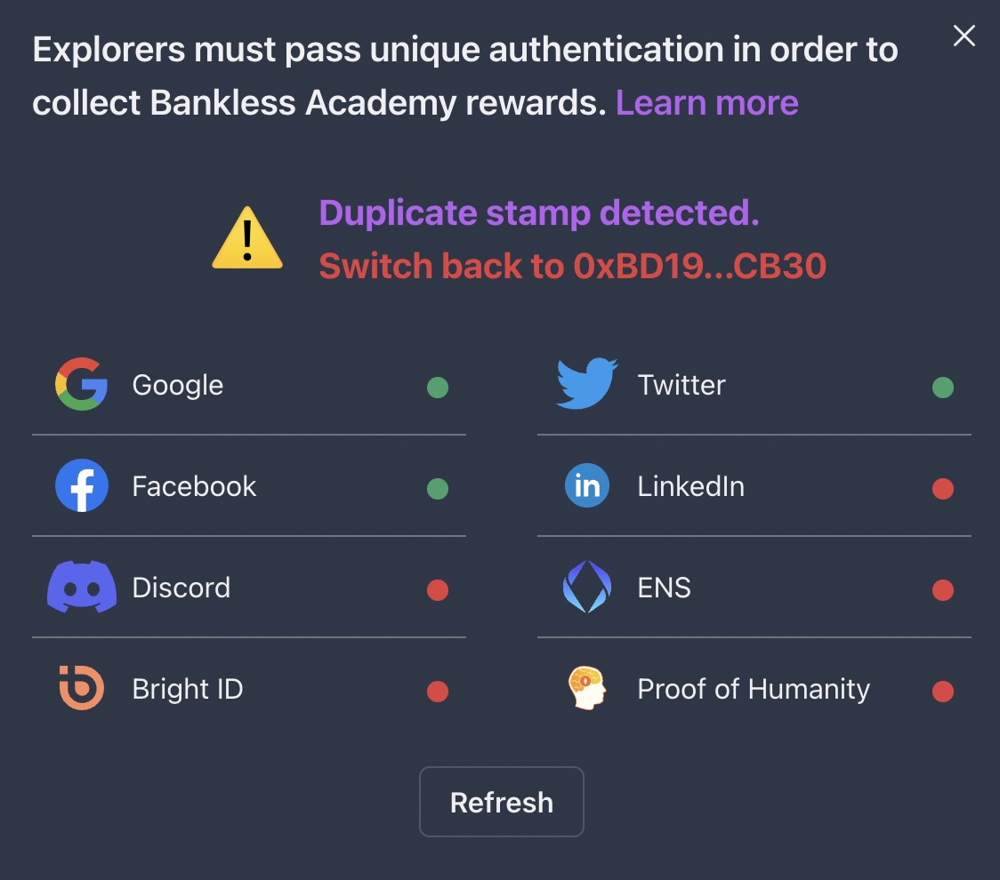
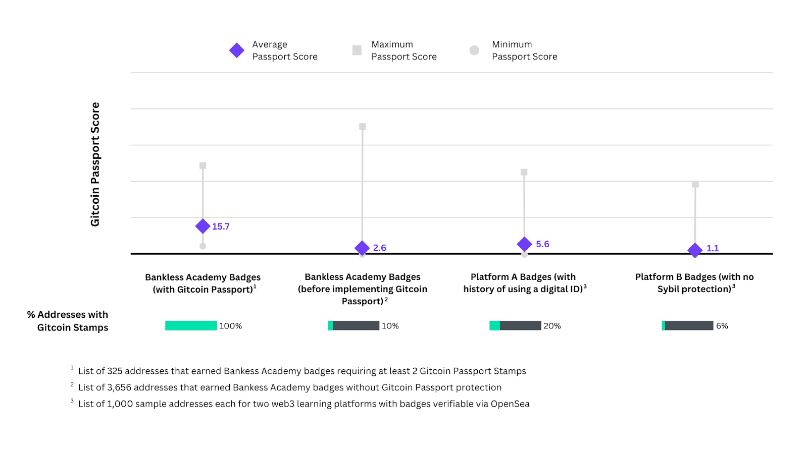
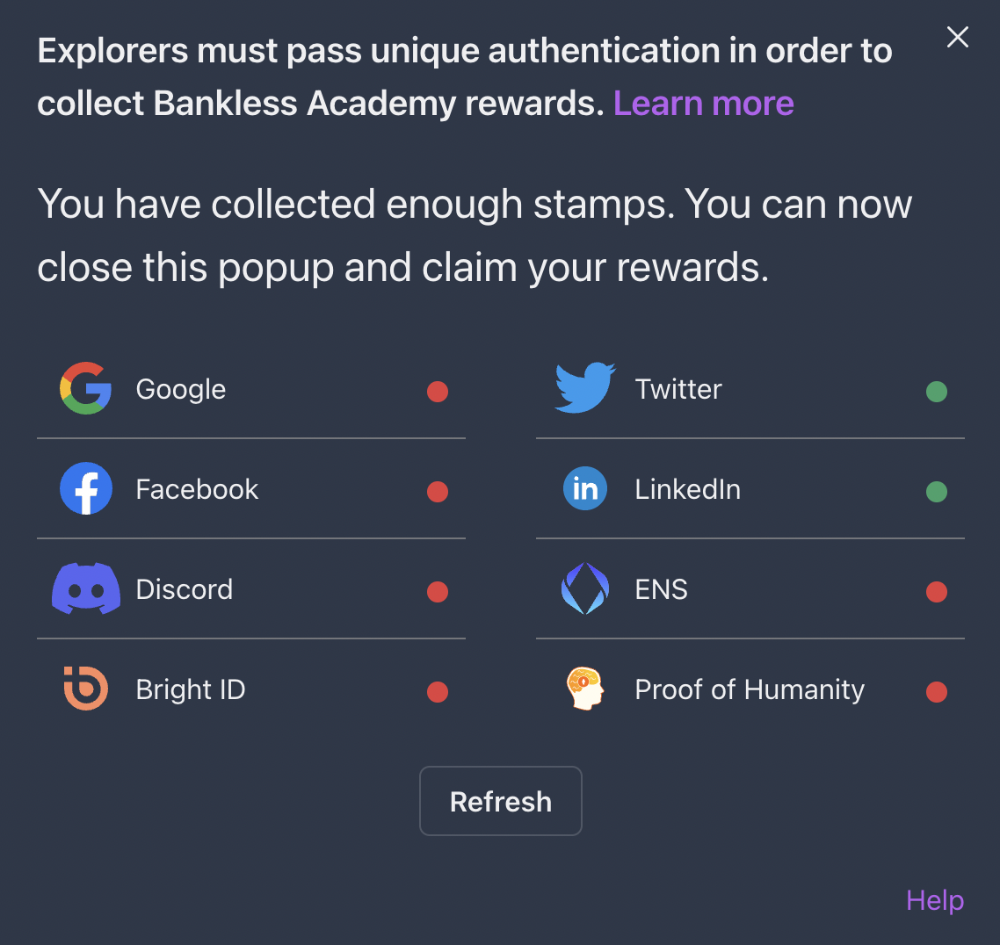

# Bankless Academy

<figure><figcaption></figcaption></figure>

by [Rohit Malekar](https://go.gitcoin.co/blog/author/rohit-malekar)

Numerous Internet-based social entities need help ensuring each individual is a real person and does not set up multiple accounts. Sybil attacks rely on an attacker creating numerous identities that are not easily distinguishable from legitimate users. By creating a mechanism to detect and reject these false identities, web3 communities can be kept safe from malicious actors. Most existing digital identification solutions are either centralized (like national ID cards) or based on an individual (like most "self-governed" identity designs). But, identity is typically intersectional and social; everyone has different information and connections with a unique set of others. This case study will review how Bankless Academy adopted a curated approach to integrating with Gitcoin Passport to defend against malicious actors earning learning credentials.

### What is Bankless Academy?

Bankless Academy is a free-to-access, open-source education platform hosting a range of lessons that help web3 users “go Bankless.” These lessons focus on topics such as Blockchain Basics, Decentralized Finance, Non-Fungible Tokens, DAOs, Community, and more - each in service of boosting user confidence and safety.

The Bankless Academy platform offers Badges that are on-chain credentials claimable by Explorers who have completed Academy lessons. Powered by Mint Kudos, Badges display the knowledge journey of Explorers across lessons and modules. To recognize achievements and deliver Badges to Explorers that have completed their lessons, the platform must confirm that it interacts with a unique user. This was enabled using integration with Gitcoin Passport.

### What is Gitcoin Passport?

Gitcoin Passport allows users to demonstrate that they possess 'trustable' credentials from either web2 or web3. Popular web2 attestations include Facebook, Twitter, Github, and Google accounts that match certain requirements (e.g., number of posts/followers). On the other hand, Passport also enables attestations from web3, such as BrightID, ENS, and Proof-of-Humanity profiles. The user only has to expose their web2/web3 accounts once, and a stamp is then created and stored in the user's Passport. No personal information is retained during this process, just the stamp with a unique identifier for the underlying account that proves that relevant evidence exists – acting like‌ zero-knowledge proof. This unique identifier protects user privacy and verifies account uniqueness across wallet addresses.

Importantly, communities using Gitcoin Passport as an identity/Sybil defense Lego can define new stamps and screen passports in ways that give them the greatest power to identify malicious users. One of the powerful features of Gitcoin Passport is that the precise combinations of stamps in a wallet can be used to generate a "trust score." As part of the tooling, Gitcoin Passport exposes an API for builders, including functions for scoring passports. This means prebuilt, free, and open-source tools for analyzing and digesting Passport data can easily be integrated into a Sybil defense/identity system. The API makes it easy for developers to adjust the way a platform scores combinations of stamps.

### How does it work at Bankless Academy?

When the Bankless Academy launched in February 2022, users could claim a POAP to prove their completion of the courses. Shortly, many users could not claim POAPs due to a massive spike in claims arising from malicious identities. The protocol depends on authorized POAP issuers to mandate only allowing attendees to get up to one POAP each. The Bankless Academy team needed a reliable procedure to prevent Sybil attacks.

The team first learned about Gitcoin Passport while participating in the Gitcoin Rounds to raise funds to launch new Academy lessons. The integration with Passport was straightforward and has been operational for four months now since October 2022. To verify a user's uniqueness in Bankless Academy, a user must collect a determined number of stamps. Each lesson can require a different number depending on which section of the skill tree the user is in.

As an example, the first lessons only require two stamps, which a user should easily be able to claim by connecting with their favorite web2 platform. The relatively low threshold for the number of stamps intentionally reduces friction for beginners in the early stages of the journey with the Bankless Academy. When a duplicate stamp is detected, the user is required to go back to the main account.

Further into the Explorer journey, new lessons will require stronger levels of verification from web3 platforms such as ENS, Bright ID, or Proof of Humanity.

### 

### A curated view of community stamps

The Gitcoin Passport & Bankless Academy team worked together to build a filtered view that shows the specific set of stamps relevant for your community that users can choose from. Here's an example of the view for the Bankless Academy Stamps. If your community is interested in having your own view of stamps curated for your users, reach out to the Gitcoin Passport team on Telegram.

### The results

The following chart depicts an analysis of the Bankless Academy badge holders before and after adopting Gitcoin Passport, along with a comparison with similar web3 learning platforms that offer credentials for course completion.

A community using Gitcoin Passport can verify a participant’s credentials with a customizable algorithm that weights different stamps based on the community’s entry criteria–essentially allowing communities to create a customizable “entry visa” with their participation requirements. To claim a Bankless Academy badge today, a user must hold at least two Gitcoin Passport stamps (equivalent to a Gitcoin Passport score of 3.0). Implementing this requirement shows a multifold increase in the average Gitcoin Passport score of badge holders in Bankless Academy compared to data before enabling this mechanism. The difference is also evident when compared with other platforms that offer credentials to users for course completions.

Along with Gitcoin Passport stamps, the team analyzed the effectiveness of using a Passport scoring service to allocate rewards based on scores assigned retroactively to wallets submitted in a sample. With two stamps alone, Bankless Academy has seen a fivefold increase in the average Gitcoin Passport score of participants achieving Bankless rewards. Hopefully, with a small redesign of this Passport implementation, that number should increase. The team plans to re-assess which stamps are used and which are best suited for the Bankless community ethos. There is also an opportunity to build a custom stamp-weighing system for the best results as part of the next steps.

### Summary

Integrating with Gitcoin Passport sets a precedent for Bankless’ Proof-of-Knowledge credentialing and, thus, the opportunity for the blockchain ecosystem to recognize the learning journey of Explorers around the globe. Gitcoin Passport is an example of composable tools being built for one purpose (Gitcoin Sybil defense) but being used creatively across web3. Besides Bankless Academy, it is being used to give roles in Ethstaker’s Discord server and add Sybil resistance to the Snapshot decentralized voting platform.

To quote the Bankless team, “the stronger you are on Sybil resistance, the stronger the value of your community.” Gitcoin Passport is a high utility open source identity, and Sybil defense Lego is one of the first in its composable solutions to help communities build their value.

When communities gate their projects with this defense, and more users create their Passport, they collectively help build the decentralized "Web3 Sybil Defense Flywheel", making Passport faster and more reliable. Together, we can make web3 a more trustworthy space to be in.

_Written with inputs from DidierKrux.eth, Tetranome.eth, and OrnΞllaWeb3.eth_
